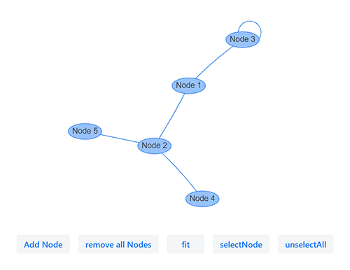

# Vis.js Timeline diagram for Vaadin Framework

Vaadin 23 Java integration of [vis-timeline](https://github.com/visjs/vis-timeline)

---
[Vis.js](http://visjs.org) is a dynamic, browser based visualization library. The library uses JSON for configuration and communication.

[vis-timeline](https://github.com/visjs/vis-time) is a visualization to display timelines.

- Forked from [alisardarian/vis-network-vaadin](https://github.com/alisardarian/vis-network-vaadin)
- Implements the new version of **vis.js timeline module (7.7.2)** for **Vaadin 23**.
- Supports **NPM** mode on Vaadin 23+
  
### vis-timelien documentation:
[https://visjs.github.io/vis-timeline/docs/timeline/(https://visjs.github.io/vis-timeline/docs/timeline/)
### vis-network examples:
[https://visjs.github.io/vis-timeline/examples/timeline/](https://visjs.github.io/vis-timeline/examples/timeline/) 
(Not everything is possible with this addon)

### Starting the test/demo server:
- Run `mvn jetty:run`.
- Open http://localhost:8080 in the browser.

